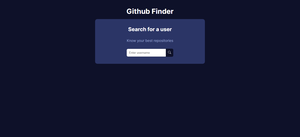
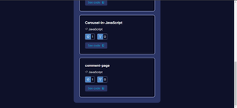
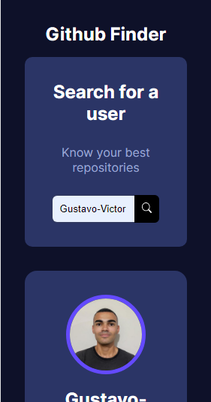
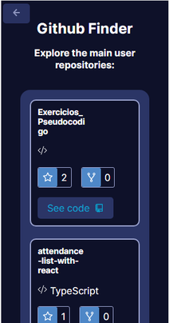

<h1 align='center'>Github Finder 🔎</h1>

<p align="center">
  <a href="#-sobre">Sobre</a>&nbsp;&nbsp;&nbsp;|&nbsp;&nbsp;&nbsp;
  <a href="#-prints">Prints</a>&nbsp;&nbsp;&nbsp;|&nbsp;&nbsp;&nbsp;
  <a href="#-tecnologias-e-ferramentas">Tecnologias e Ferramentas</a>&nbsp;&nbsp;&nbsp;|&nbsp;&nbsp;&nbsp;
  <a href="#-funcionalidades">Funcionalidades</a>&nbsp;&nbsp;&nbsp;|&nbsp;&nbsp;&nbsp;
  <a href="#-instalação">Instalação</a>&nbsp;&nbsp;&nbsp;|&nbsp;&nbsp;&nbsp;
    <a href="#-possíveis-melhorias">Possíveis melhorias</a>&nbsp;&nbsp;&nbsp;|&nbsp;&nbsp;&nbsp;
  <a href="#-licença">Licença</a>&nbsp;&nbsp;&nbsp;|&nbsp;&nbsp;&nbsp;
</p>

<p align="center">
    
</p>

<p align="center">
    
    
    
    
</p>


## ❓ Sobre

Este projeto é uma aplicação React simples que serve para buscar por usuários do Github e retornar dados deles e de seus repositórios. O projeto foi baseado em um tutorial do youtube do canal Hora de Codar, porém fiz algumas modificações que achei necessário para tornar o projeto mais único.  

Clique [aqui]() para conferir como ficou o projeto no [Codesandbox](https://codesandbox.io).


## 📷 Prints

  
 

 


## 🛠 Tecnologias e Ferramentas

- [HTML](https://developer.mozilla.org/pt-BR/docs/Web/HTML)
- [ReactJS](https://pt-br.reactjs.org/)
- [React Router Dom](https://reactrouter.com/en/main)
- [React Icons](https://react-icons.github.io/react-icons/)
- [Sass](https://sass-lang.com/)
- [TypeScript](https://www.typescriptlang.org/)
- [Vite](https://vitejs.dev/)


## ⚙ Funcionalidades 

- [x] Buscar e exibir dados de usuário do Github usando Fetch API 
- [x] Buscar e exibir dados de alguns repositórios desse usuário 
- [x] Utilização de rotas na aplicação através da biblioteca React Router Dom 


## 💻 Instalação 

Para abrir e executar o projeto no seu computador, você vai precisar ter o [Node.js](https://nodejs.org/en) instalado na sua máquina (recomendo baixar a versão LTS). Além disso, para conseguir executar os comandos de terminal a seguir, você precisará ter instalado o [GIT](https://git-scm.com/) na sua máquina. 
É recomendado ter alguns conhecimentos básicos de HTML, CSS e JavaScript para conseguir entender os códigos do projeto e também ter alguma noção prévia de comandos de terminal para conseguir acompanhar as instruções a seguir no seu computador.
Para abrir o projeto na máquina local, basta seguir os passos: 


1. Faça download do projeto no seu computador ou clone ele com o seguinte comando: 

```bash 
    git clone https://github.com/Gustavo-Victor/github-finder.git
```
 
2. Descompacte o arquivo do projeto e abra a pasta do projeto; se tiver clonado basta só abrir a pasta do projeto; você pode abrir a pasta usando um comando de terminal: 

```bash 
    cd github-finder/ 
```

3. Instale as dependências necessárias do projeto (a pasta do projeto precisa estar aberta no terminal): 

```bash 
    npm install 
```

4. Executar projeto no modo de desenvolvimento: 

```bash 
    npm run dev 
```

5. Abrir o projeto no seu navegador de preferência. Basta digitar na barra de pesquisa: http://localhost:5173/


## 👌 Possíveis melhorias

- Adicionar paginação de repositórios para trazer mais e listar melhor todos os repositórios do usuário. 


## 📝 Licença 

O projeto está sob a [Licensa MIT](./LICENSE) 

Qualquer pessoa pode usar, clonar e contribuir com este projeto. 

